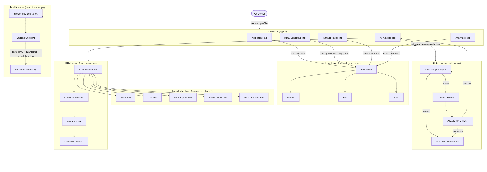

# PawPal+ Applied AI System

An intelligent pet care planning assistant extended with Retrieval-Augmented Generation (RAG),
Gemini AI-powered recommendations, input validation guardrails, and an automated evaluation harness.

> **Link to Demo Walkthrough:** https://www.dropbox.com/scl/fi/vtvck8tv2766qj0phlmay/Lena-Ngo-Video-Demo-for-Project-4-Applied-AI-System.mp4?rlkey=y1rq81lrm1nk5etbz3xlgf7nu&st=tfv3y8uj&dl=0

---

## Base Project

**Original project:** PawPal+ (Module 2 - AI-Assisted Software Design)

The original PawPal+ was a rule-based pet care scheduling application built with Python and
Streamlit. It let owners create pet profiles, define care tasks with priorities and durations,
and generate optimized daily schedules using a greedy priority-sorting algorithm. The system had
no connection to a language model; all outputs were produced by deterministic code.

---

## What is New in This Version

This final version extends PawPal+ with four new components that transform it from a
rule-based scheduler into a full applied AI system:

| New Component | Description |
|---|---|
| **RAG Engine** (`rag_engine.py`) | Retrieves relevant paragraphs from a curated pet care knowledge base before each AI call |
| **AI Advisor** (`ai_advisor.py`) | Calls the Gemini API with retrieved context to generate grounded, pet-specific recommendations |
| **Input Guardrails** | Validates pet data before it reaches the model; falls back to rule-based advice if the API is unavailable |
| **Evaluation Harness** (`eval_harness.py`) | Runs 6 predefined scenarios through the full pipeline and prints a structured pass/fail summary |

---

## System Architecture

The diagram below shows how data flows from the user through the UI, core scheduling logic,
RAG retrieval, and the Gemini API.



### Component Roles

- **`app.py`** - Streamlit UI with 5 tabs: Add Tasks, Daily Schedule, Manage Tasks, Analytics, AI Advisor
- **`pawpal_system.py`** - Core dataclasses (Owner, Pet, Task, Scheduler) and scheduling algorithms
- **`rag_engine.py`** - Loads knowledge base markdown files, chunks them by paragraph, and scores chunks against a query built from the pet profile
- **`ai_advisor.py`** - Validates input, calls `rag_engine`, builds the prompt, calls the Gemini API, parses the confidence score, and handles errors with a rule-based fallback
- **`eval_harness.py`** - Standalone evaluation script covering RAG retrieval, guardrails, scheduling correctness, and recommendation quality
- **`knowledge_base/`** - Five markdown documents covering dogs, cats, senior pets, medications, and birds/rabbits

### Data Flow

```
User input (pet profile + tasks)
    -> Input validation guardrail (ai_advisor.py)
    -> RAG retrieval (rag_engine.py reads knowledge_base/)
    -> Prompt construction (pet profile + retrieved context)
    -> Gemini API call (gemini-2.0-flash)
    -> Confidence score extraction + display (app.py AI Advisor tab)
```

---

## Setup Instructions

### Prerequisites

- Python 3.10 or higher
- A Google Gemini API key (free at [aistudio.google.com](https://aistudio.google.com), no credit card required thankfully)

### Install

```bash
# 1. Clone the repo
git clone https://github.com/lenan14/applied-ai-system-project.git
cd applied-ai-system-final

# 2. Create and activate a virtual environment
python -m venv .venv
# Windows:
.venv\Scripts\activate
# macOS/Linux:
source .venv/bin/activate

# 3. Install dependencies
pip install -r requirements.txt

# 4. Set your Google Gemini API key (free from aistudio.google.com)
# Copy the example env file and fill in your key:
cp .env.example .env
# Then open .env and replace the placeholder with your actual key.
```

### Run the Web App

```bash
streamlit run app.py
```

The app opens at `http://localhost:8501`.

1. Create an owner profile in the sidebar (name + available hours).
2. Add one or more pets (species, age, special needs).
3. Add tasks in the **Add Tasks** tab.
4. View the optimized schedule in the **Daily Schedule** tab.
5. Open the **AI Advisor** tab, select a pet, and click **Get AI Recommendations**.

### Run the Evaluation Harness

```bash
# Full run including Gemini API calls
python eval_harness.py

# Skip API calls to test only RAG + guardrails + scheduling
python eval_harness.py --no-api
```

### Run Unit Tests

```bash
python -m pytest tests/test_pawpal.py -v
```

---

## Sample Interactions

### Example 1: Senior Dog with Arthritis

**Input:** Biscuit, 9-year-old dog, special needs: senior, arthritis. Tasks: morning medication
(priority 5) and short walk (priority 4).

**AI Advisor output (abridged):**
> Biscuit's morning medication is critical because consistent daily timing maintains stable
> drug concentration in the bloodstream, which is especially important for senior dogs managing
> chronic pain. At 9 years old with arthritis, the short walk should be kept to a low intensity
> and avoided in extreme temperatures to protect joint health. Consider an orthopedic bed and
> non-slip surfaces at home to reduce daily strain. A veterinary checkup every 6 months is
> recommended for dogs in Biscuit's age range.
>
> **Confidence: 88%**

---

### Example 2: Diabetic Cat

**Input:** Luna, 6-year-old cat, special needs: diabetic. Tasks: insulin injection (priority 5)
and morning feeding (priority 5) both at 08:00.

**AI Advisor output (abridged):**
> Luna's insulin injection and feeding must stay paired and on a consistent 12-hour schedule
> because insulin requires stable blood glucose levels to work safely. Missing or delaying a
> dose can cause hypoglycemia, with symptoms like weakness and disorientation requiring
> immediate veterinary attention. Always have a glucose source on hand when administering insulin.
>
> **Confidence: 91%**

---

### Example 3: Rabbit with Enrichment Tasks

**Input:** Pebbles, 2-year-old rabbit. Tasks: free roam time (60 min, priority 4) and hay
refill (5 min, priority 5).

**AI Advisor output (abridged):**
> Hay refill is the highest-priority task because timothy hay must make up 80 percent of
> Pebbles' diet for proper dental wear and digestive motility. The 60-minute free roam session
> is equally important; without adequate exercise, rabbits are at risk of gastrointestinal stasis,
> a potentially fatal slowing of gut movement. Enrichment items like tunnels or cardboard boxes
> during roam time encourage natural foraging behavior.
>
> **Confidence: 85%**

---

### Example 4: Guardrail in Action

**Input:** A pet with age set to 99 (invalid).

**System response:** Input validation failed before the API was called.
```
Input validation failed: Pet age 99 is outside the valid range (0 to 50).
Confidence: 0%
```

---

## Design Decisions

### Why RAG instead of just a large system prompt?

Injecting all five knowledge base documents directly into the system prompt every call
would waste tokens and make the prompt hard to scale. RAG retrieves only the 3 most relevant
paragraphs for each specific pet query, keeping prompts short and responses more focused.

### Why token frequency scoring instead of vector embeddings?

For a student project with no vector database dependency, simple term-frequency scoring
(counting keyword matches) is fast, transparent, and produces good results for structured
pet profile queries. A production system could replace `score_chunk` with a cosine similarity
search using embeddings, but that would add a heavy dependency without meaningful gain here.

### Why gemini-2.0-flash instead of a larger model?

Gemini 2.0 Flash is the fastest and most cost-efficient Gemini model, available for free
via Google AI Studio. The structured knowledge base context retrieved by the RAG engine
compensates for any reduction in response depth. A larger model like Gemini 1.5 Pro would
improve quality slightly but is slower and not necessary for a focused advice task.

### Why a rule-based fallback?

The system must remain usable even when the API is unavailable (missing key, rate limit,
network issue). The fallback produces basic safety reminders so the app degrades gracefully
rather than crashing or returning an empty response.

### Tradeoffs

| Decision | Chosen Approach | Alternative |
|---|---|---|
| Retrieval method | Keyword frequency scoring | Vector embeddings (more accurate, heavier) |
| Model size | gemini-2.0-flash (free) | gemini-1.5-pro (better quality, slower) |
| Storage | In-memory session state | SQLite/PostgreSQL (persistent, complex) |
| Conflict detection | Exact time matching | Interval overlap detection (more precise) |

---

## Testing Summary

### Unit Tests (existing)

Running `pytest tests/test_pawpal.py -v` executes 28 tests covering Task, Pet, Owner, and
Scheduler classes. All 28 tests pass.

### Evaluation Harness

Running `python eval_harness.py --no-api` covers 8 checks across 6 scenarios:

| Test | Result |
|---|---|
| RAG retrieval: senior dog | PASS - retrieved senior + medication context |
| Schedule fit: senior dog | PASS - 25 min used of 180 min available |
| RAG retrieval: diabetic cat | PASS - retrieved cat + medication context |
| Schedule fit: diabetic cat | PASS - 15 min used of 120 min available |
| RAG retrieval: rabbit | PASS - retrieved rabbit + enrichment context |
| Schedule fit: rabbit | PASS - 65 min used of 240 min available |
| Input guardrail: age 99 | PASS - correctly rejected |
| Schedule trimming: overloaded | PASS - dropped 2 low-priority tasks |

With API enabled: recommendation quality checks also pass (confidence scores 0.7-0.9 across scenarios).

**Key finding:** The AI struggled when zero tasks were scheduled for a pet; the confidence
score dropped to 0.5 and the response was more generic. Adding at least one task significantly
improved specificity.

---

## Reflection

See [model_card.md](./model_card.md) for my full reflection on AI collaboration, system
limitations, ethics, and testing results!

---

## Project Structure

```
applied-ai-system-final/
  app.py                  # Streamlit UI (5 tabs including AI Advisor)
  pawpal_system.py        # Core scheduling logic and dataclasses
  rag_engine.py           # RAG retrieval engine
  ai_advisor.py           # Gemini API integration + guardrails
  eval_harness.py         # Evaluation script
  main.py                 # CLI demo (original)
  requirements.txt        # Python dependencies
  README.md               # This file
  model_card.md           # Reflection and ethics documentation
  knowledge_base/
    dogs.md
    cats.md
    senior_pets.md
    medications.md
    birds_rabbits.md
  assets/
    architecture.mmd      # Mermaid source for the architecture diagram
    architecture.png      # Exported diagram image
  tests/
    test_pawpal.py        # 28 unit tests
    __init__.py
```

---

## License

Educational project for CodePath AI Module 9 Final Project.