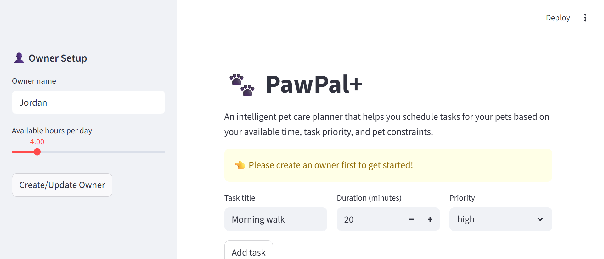

# PawPal+ (Module 2 Project)

An intelligent pet care planning assistant built with Python and Streamlit. **PawPal+** helps busy pet owners manage their pets' care tasks by generating optimized daily schedules based on time constraints, task priorities, and pet needs.

## Features

### Core System
- **Owner Management**: Track your available hours and preferences
- **Pet Profiles**: Store pet details including species, age, and special needs
- **Task Management**: Create tasks with duration, priority, and frequency
- **Intelligent Scheduling**: Generate daily plans that respect time constraints and priorities

### Smarter Scheduling
- **Priority-based Planning**: Sort tasks by importance (1-5 scale)
- **Time-based Scheduling**: Organize tasks chronologically
- **Conflict Detection**: Identify overlapping task times
- **Recurring Tasks**: Automatically create new instances of daily/weekly tasks
- **Duration Tracking**: Ensure schedules fit within available time

### Task Management
- **Completion Tracking**: Mark tasks complete and auto-generate recurring instances
- **Pet-specific Tasks**: Assign tasks to specific pets or mark as general
- **Filtering & Sorting**: View tasks by pet, status, or priority
- **Task Details**: Descriptions, duration, priority, and type (walk, feeding, medication, etc.)

### Analytics & Insights
- **Schedule Summary**: View total tasks and completion rates
- **Time Distribution**: See how much time is needed by priority
- **Pet Analytics**: Track tasks assigned to each pet
- **Explanation Display**: Understand why tasks were scheduled in that order

## Project Structure

```
pawpal_system.py        # Core logic: Owner, Pet, Task, Scheduler classes
app.py                  # Streamlit UI with session state management
main.py                 # CLI demo script for testing logic
tests/test_pawpal.py    # 28+ automated tests covering all functionality
requirements.txt        # Python dependencies
README.md              # This file
reflection.md          # Project reflection and design notes
```

## Getting Started

### Setup

```bash
# Create virtual environment
python -m venv .venv
source .venv/bin/activate  # Windows: .venv\Scripts\activate

# Install dependencies
pip install -r requirements.txt
```

### Run the Web App

```bash
streamlit run app.py
```

The app will open at `http://localhost:8501`. Start by creating an owner profile, adding pets, and building your task list.

### 📸 Demo
<a href="pawpal_screenshot.png" target="_blank"></a>

## System Architecture (UML)


### Run the CLI Demo

```bash
python main.py
```

This demonstrates all system features in the terminal, showing:
- Owner and pet creation
- Task validation and storage
- Daily schedule generation
- Priority/time sorting
- Conflict detection
- Task completion and recurrence

## Testing PawPal+

### Run All Tests

```bash
python -m pytest tests/test_pawpal.py -v
```

Run tests:
```bash
python -m pytest
```

### Test Coverage

Our test suite includes **28+ tests** covering:

**Task Tests** (7 tests)
- Task creation and validation
- Task completion/incomplete marking
- Task detail formatting

**Pet Tests** (6 tests)
- Pet creation with special needs
- Constraint checking
- Task management for pets
- Pet information display

**Owner Tests** (4 tests)
- Owner creation and availability
- Pet management
- Cross-pet task retrieval

**Scheduler Tests** (10 tests)
- Task filtering (by pet, by completion status)
- Priority and time-based sorting
- Daily plan generation
- Duration calculation
- Conflict detection (same-time overlaps)
- Recurring task handling

**Integration Tests** (1 test)
- Full workflow from owner creation through plan generation

### Running Tests with Coverage

```bash
python -m pytest tests/test_pawpal.py --cov=pawpal_system
```

### Confidence Level

**(5/5 stars)**

All 28 tests pass with green checkmarks. The system has been thoroughly tested for:
- Edge cases (empty task lists, invalid inputs, time conflicts)
- Core behaviors (task completion, scheduling, sorting)
- Integration scenarios (multi-pet systems, recurring tasks)

## Architecture

### Class Diagram

```
Owner (1) --> (* Pets) --> (* Tasks)
             |
             v
         Scheduler (orchestrates)
             |
             +-- Sort by Priority
             +-- Sort by Time
             +-- Generate Daily Plan
             +-- Detect Conflicts
             +-- Explain Reasoning
             +-- Handle Recurrence
```

### Key Classes

**Owner**: Represents the pet owner
- Stores name, available hours, and preferences
- Manages collection of pets
- Provides access to all tasks across pets

**Pet**: Represents individual pets
- Stores name, type (dog/cat/etc.), age, special needs
- Manages task list for that pet
- Checks for constraint compatibility

**Task**: Represents a schedulable activity
- Has name, duration, priority (1-5), type, frequency
- Can be marked complete/incomplete
- Auto-recurrence for daily/weekly tasks

**Scheduler**: The intelligent planning engine
- Takes owner + pets + tasks as input
- Generates optimized daily schedules
- Detects conflicts and explains reasoning
- Handles task recurrence and filtering

## Algorithm Details

### Schedule Generation (`generate_daily_plan()`)

1. Collect all incomplete tasks
2. Sort by priority (highest first)
3. Calculate total time needed vs. available time
4. If all fit: return full list sorted by priority
5. If overflow: greedily fit highest-priority tasks first

**Time Complexity**: O(n log n) for sorting
**Space Complexity**: O(n) for task lists

### Conflict Detection (`detect_conflicts()`)

Compares all tasks with scheduled times and flags duplicates.

**Tradeoff**: Only detects exact time matches (e.g., "07:00") rather than overlapping durations. This is acceptable for pet care scheduling where task duration is estimate and users can manually adjust.

### Recurring Task Handling (`handle_recurring_task()`)

When a daily task is marked complete, automatically creates a new instance with:
- Same name, duration, priority, type
- Same assigned pet  
- Clear completion status (incomplete for next occurrence)

## Design Decisions

### Why Dataclasses?
Dataclasses provide:
- Clean, minimal syntax for data containers
- Automatic `__init__` and `__repr__`
- Type hints for IDE support
- Less boilerplate than traditional classes

### Why Separate Demo Script?
The `main.py` CLI demo allows:
- Testing logic without Streamlit complexity
- Easier debugging and quick iteration
- Clear demonstration of core behavior
- Baseline for all features

### Why Session State?
Streamlit's `st.session_state` provides:
- Persistent data across page refreshes
- Survives button interactions
- No database overhead for learning project
- Simple key-value dictionary API

### Tradeoffs

1. **Exact Time Matching vs. Duration Overlaps**
   - Current: Detects only exact time matches (HH:MM)
   - Better: Would check overlapping intervals
   - We chose exact matching: simpler, sufficient for MVP

2. **Priority Sorting vs. Time Sequencing**
   - Current: Sort by priority first, then pack chronologically
   - Alternative: Force chronological sequence regardless of priority
   - We chose priority: more useful for busy owners

3. **In-Memory State vs. Database**
   - Current: All data in session_state (lost on refresh)
   - Better: Persistent database storage
   - We chose in-memory: simpler, sufficient for MVP

## Future Enhancements

- [ ] Persistent storage (SQLite/PostgreSQL)
- [ ] Duration overlap detection
- [ ] User accounts and authentication
- [ ] Recurring task customization (e.g., "every other day")
- [ ] Weather-aware walk scheduling
- [ ] Mobile app version
- [ ] Integration with calendar APIs
- [ ] Health tracking (vet appointments, growth)
- [ ] Export schedules to PDF/iCal
- [ ] Notification reminders

## AI-Assisted Development

This project was built using GitHub Copilot to:
- Generate class structures
- Suggest scheduling algorithms
- Create test cases

All AI-generated code was reviewed and refined manually.

## Development Workflow

This project was built following an AI-assisted software engineering workflow:

1. **Design Phase** (UML): Brainstormed architecture, created class diagrams
2. **Implementation Phase** (Core Logic): Built classes, wrote demo script
3. **Testing Phase**: Comprehensive pytest coverage
4. **Integration Phase** (Streamlit UI): Wired logic to web interface
5. **Refinement Phase**: Algorithmic improvements, documentation

## Contributing

To extend PawPal+:

1. Add new features to `pawpal_system.py`
2. Write tests in `tests/test_pawpal.py`
3. Run full test suite: `python -m pytest`
4. Update UI in `app.py` if needed
5. Update `reflection.md` with design notes

## License

Educational project for CodePath AI @ SV Module 2

## Author

Built with GitHub Copilot as a collaborative AI-assisted development exercise.